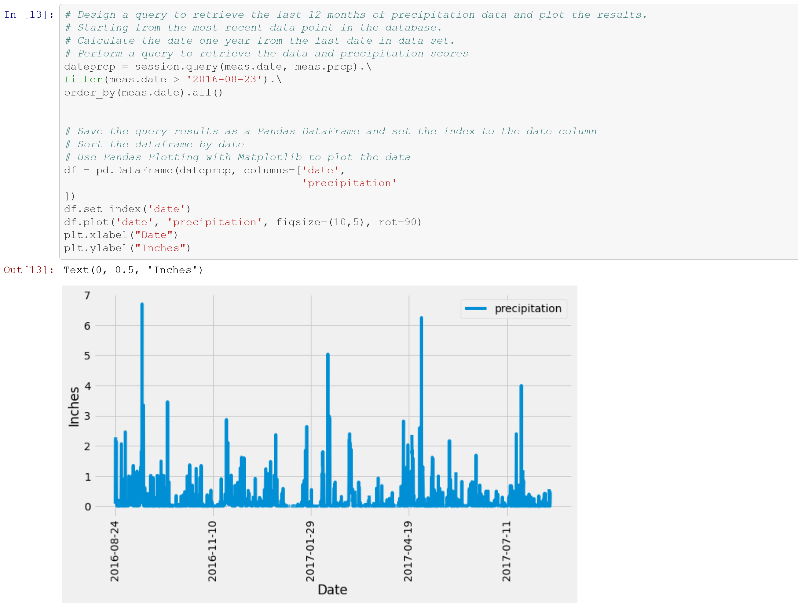
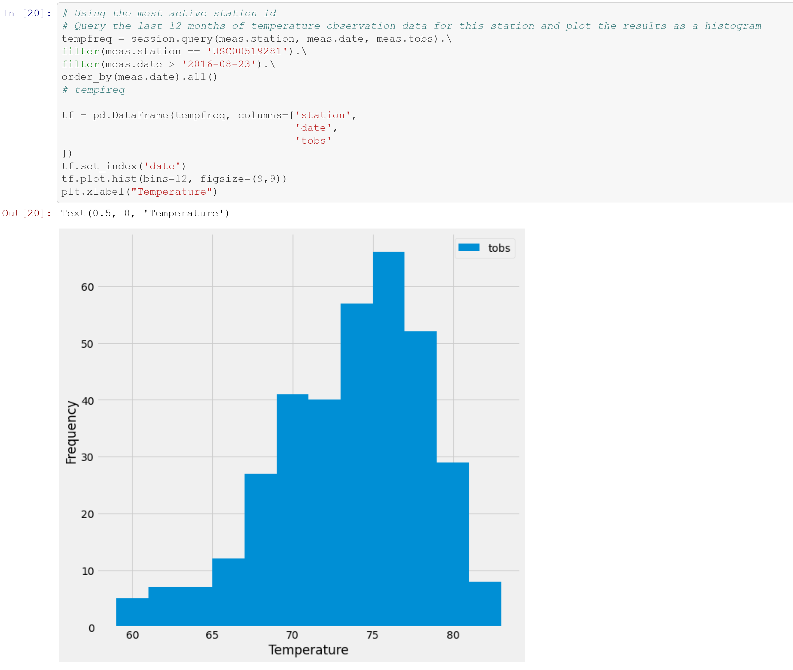

# sqlalchemy-climate-analysis

This exercise will entail performing climate analysis on the area Honolulu, Hawaii.

## 

## Step 1 - Climate Analysis and Exploration

I will use Python and SQLAlchemy to do basic climate analysis and data exploration of the climate database. All of the following analysis will be completed using SQLAlchemy ORM queries, Pandas, and  Matplotlib.

### Precipitation Analysis

- I started by finding the most recent date in the data set.

- Using this date, I retrieved the last 12 months of precipitation data. 

- I then selected only the `date` and `prcp` values and loaded the query results into a Pandas DataFrame.

- Sort the DataFrame values by `date`.

- Finally, I plotted the results using the DataFrame `plot` method and I used Pandas to print the summary statistics for the precipitation data.

  

  

### Station Analysis

- Next I designed a query to calculate the total number of stations in the dataset and also to find the most active stations so that I could:

  - List the stations and observation counts in descending order.

  - Using the most active station id, calculate the lowest, highest, and average temperature.

    

- Lastly, I designed a query to retrieve the last 12 months of temperature observation data (TOBS).

  - I then filtered by the station with the highest number of observations.

  - Queried the last 12 months of temperature observation data for this station.

  - Plotted the results as a histogram with `bins=12`.

    

------

## 

## Step 2 - Climate App

Now that I have completed the initial analysis, I designed a Flask API based on the queries that I have just developed and created the following routes:

### Routes

- `/`
  - Home page.
  - List all available routes.
- `/api/v1.0/precipitation`
  - Convert the query results to a dictionary using `date` as the key and `prcp` as the value.
  - Return the JSON representation of the dictionary.
- `/api/v1.0/stations`
  - Return a JSON list of stations from the dataset.
- `/api/v1.0/tobs`
  - Query the dates and temperature observations of the most active station for the last year of data.
  - Return a JSON list of temperature observations (TOBS) for the previous year.
- `/api/v1.0/<start>` and `/api/v1.0/<start>/<end>`
  - Return a JSON list of the minimum temperature, the average  temperature, and the max temperature for a given start or start-end  range.
  - When given the start only, calculate `TMIN`, `TAVG`, and `TMAX` for all dates greater than and equal to the start date.
  - When given the start and the end date, calculate the `TMIN`, `TAVG`, and `TMAX` for dates between the start and end date inclusive.

